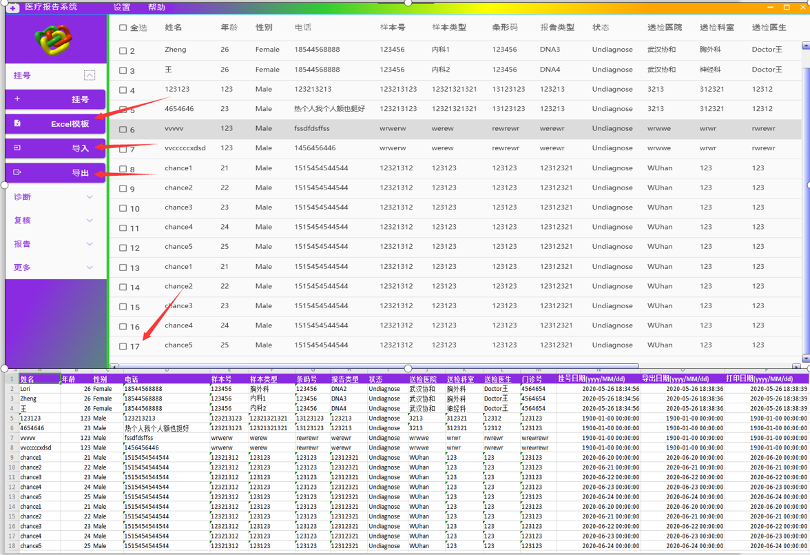
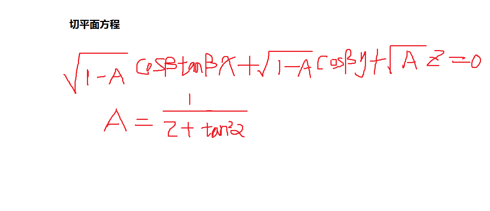
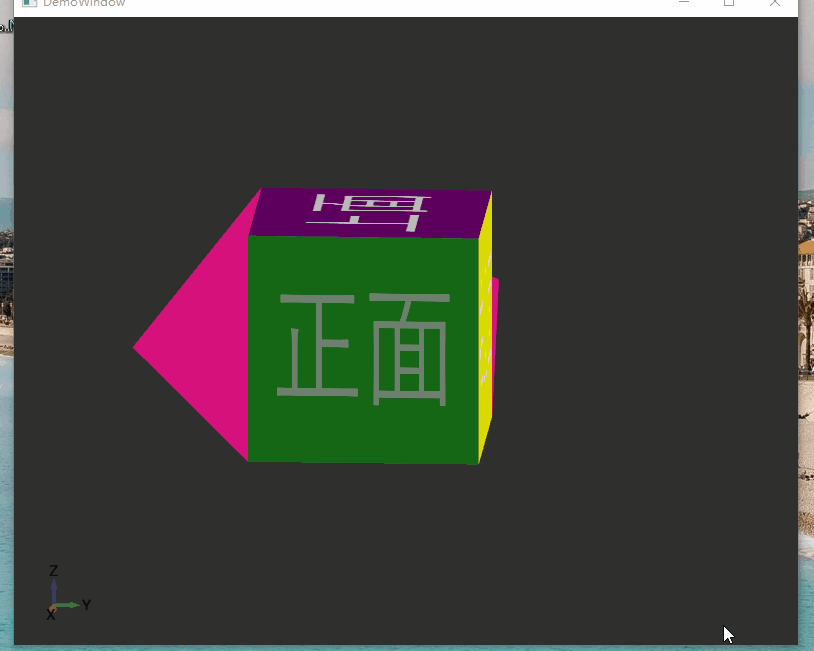

[](https://gitee.com/ChanceZXY/WPFCoreUniversalApp)
# 项目由来
本人一直从事PC端开发工作，主要集中在医疗和工业软件开发，所以就想写一款通用的PC端模板，包括医疗系统，工业控件，教育，会涉及到比较多的2D,3D图像，可能会涉及到算法，便于以后快速开发，之前也写过一些自定义控件和视图，现在正好用到这个项目模板中，有问题可加QQ群交流：658794308。
# 项目介绍
WPFCoreUniversalApp是从零开始，基于.NetCore31,采用MVVM模式,目前连接的是Mysql数据库，准备分为两大块：医疗(Medical),工业（Factory）,其中包含UserControl,CustomControl,Animation,2D,ViewPor3D,日志记录，Excel文档交互，二维码控件，手写的ORM，IOC，权限认证和管理等等。另外我写了一些常用的控件[桌面自定义控件(基于.Net Core3.1)](https://gitee.com/ChanceZXY/DesktopCustomControl)，比如二维码控件(配置即可生成想要的任意二维码)，MessageDialog（弹窗提示View）等。

- UI布局------------------------------√
- 窗口开启和关闭动画(2D和3D)-----√
- 用户注册和修改---------------------√
- ORM--------------------------------√
- IOC----------------------------------√
- 数据加密(MD5、DES)----------------√
- MedicalReport界面布局--------------------√
- 用户身份校验-----------------------×
- 权限分配和管理----------------------×
- 日志文件-----------------------------×
- Excel文档交互------------------------√
- 图形(折线、曲线、饼图、柱状图等)-------------------√
- 软件自动更新------------------------√
- 想到什么补充什么吧。。。。。。

登陆效果图(2D/3D)：


### 登陆界面切换3D动画核心代码如下：
```
<!--3D动画-->
<userCtl:LoginAnimation3DControl Grid.ColumnSpan="2" Visibility="Visible"/>

<!--如果你不想要3D动画，可以选择这个，-->
<Grid Grid.ColumnSpan="2" Visibility="Collapsed">
    <!--用户登录-->
    <userCtl:LoginControl x:Name="Login"
        Visibility="{Binding UserOperationType,Converter={StaticResource LoginRegisterVisibilityConverter},ConverterParameter=Login}"/>

    <!--用户注册-->
    <userCtl:RegisterControl x:Name="Register" 
        Visibility="{Binding UserOperationType,Converter={StaticResource LoginRegisterVisibilityConverter},ConverterParameter=Register}"/>

    <!--忘记密码-->
    <userCtl:ForgotPasswordControl x:Name="ForgotPassword" 
        Visibility="{Binding UserOperationType,Converter={StaticResource LoginRegisterVisibilityConverter},ConverterParameter=ForgotPassword}"/>
</Grid>
```
### 医疗报告系统效果图(布局完成，功能模块一部分)
- 查看、登记、编辑、刷新、删除-----------------√
- Excel模板、 导入、导出(Excel、Word)--------------------------√
- 诊断-------------------------------------------------√
- 数据转PDF，XML，Json-----------------------------×
- 转为图形统计(2D、3D)-----------------------------√
- 。。。。。。



#### 诊断可实现图片轮播浏览，还可以查看360度全景详细图片


### 3D图像平面切割效果（可任意角度去切割三维图形），项目中有例子，有兴趣的可自行查看
以下示范立方体的，原理如下:假设平面内有一定点P(0)(该点也在三维图形空间内)，过定点P0的法向量为P(n),设该平面的任意一点坐标为P(x,y,z)，则通过法向量垂直平面即可求出平面方程，若P(0)=(0,0,0)，则切平面方程为：
P(n).X*x + P(n).Y*y + P(n).Z*z = 0,若P(0)非原点，可通过在y轴上平移得到切平面方程式，即必存在一个常量N满足P(n).X*x + P(n).Y*y + P(n).Z*z + N = 0(即为切平面方程通用公式)。设切平面与XY轴面的夹角α[0,π]，切平面旋转的角度β[0,2π],最后我推导得到切平面通用用方程表达式如下(先计算过原点的，之后可通过平移得到)：



### 图表控件(图像理论上可绘制达1000万个点)


#### 由于自己开发太慢而且很累(需要写动画效果,控件逻辑等)，所以现在引入了第三方控件，具体看管理包。另外我把3D球体和圆柱体的推导方法放在了~/DesktopUniversalFrame/Entity/ArithmeticInfer下面，感兴趣的可以看看，其它像正方体、长方体的建模就比较简单了，不会的可以自己查资料，微软官方文档也有说明，弄清楚原理再去画3D就非常简单了，借助第三方控件就更容易点，后面有时间的话把动画在Xaml和后台的写法单独弄一块，学会这些就可以做出很炫丽的可视化界面了。
#### 如果您觉得这个项目对你来说用得上，麻烦老哥点个Start。希望与各位还在PC开发的小伙伴一起交流学习，有什么问题可以随时在下方留言，本项目最终目的是要做出一款满足实际工作业务需求控件和视图。好了，就扯到这里吧，我去继续撸码了！
