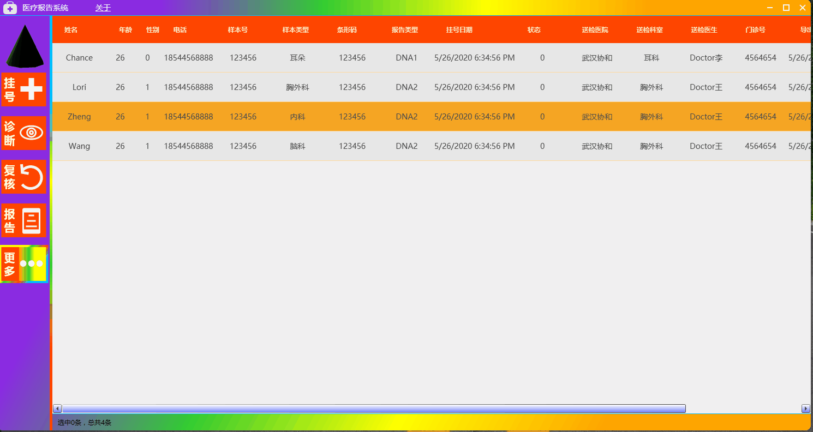

[](https://gitee.com/ChanceZXY/DesktopCustomControl)
# 项目由来
本人一直从事PC端开发工作，主要集中在医疗和工业软件开发，所以就想写一款通用的PC端模板，包括医疗系统，工业控件，会涉及到比较多的2D,3D图像，可能会涉及到算法(这块暂时不熟，慢慢整吧)，便于以后快速开发，之前写过一些自定义控件和视图，现在正好用到这个项目模板中。
# 项目介绍
WPFCoreUniversalApp是从零开始，基于.NetCore31,采用MVVM模式，准备分为两大块：医疗(Medical),工业（Factory）,其中包含UserControl,CustomControl,Animation,2D,ViewPoer3D,自定义IOC,日志记录，Excel文档交互，二维码控件，手写的ORM，IOC，权限认证和管理等等，大部分控件来自于我写的另一个项目[桌面自定义控件(基于.Net Framework)](https://gitee.com/ChanceZXY/DesktopCustomControl)，比如二维码控件(配置即可生成想要的任意二维码)，MessageDialog（弹窗提示View）等。

- UI布局------------------------------√
- 窗口开启和关闭动画(2D和3D)-----√
- 用户注册和修改---------------------√
- ORM--------------------------------√
- IOC----------------------------------√
- 数据加密(MD5、DES)----------------√
- MedicalReport界面布局--------------------√
- 用户身份校验-----------------------×
- 权限分配和管理----------------------×
- 日志文件-----------------------------×
- Excel文档交互------------------------x
- 数据统计(图形)----------------------×
- 想到什么补充什么吧。。。。。。

第一次效果图(2D)：

第二次效果图(3D)：


### 登陆界面切换3D动画核心代码如下：
```
<!--3D动画-->
<userCtl:LoginAnimation3DControl Grid.ColumnSpan="2" Visibility="Visible"/>

<!--如果你不想要3D动画，可以选择这个，-->
<Grid Grid.ColumnSpan="2" Visibility="Collapsed">
    <!--用户登录-->
    <userCtl:LoginControl x:Name="Login"
        Visibility="{Binding UserOperationType,Converter={StaticResource LoginRegisterVisibilityConverter},ConverterParameter=Login}"/>

    <!--用户注册-->
    <userCtl:RegisterControl x:Name="Register" 
        Visibility="{Binding UserOperationType,Converter={StaticResource LoginRegisterVisibilityConverter},ConverterParameter=Register}"/>

    <!--忘记密码-->
    <userCtl:ForgotPasswordControl x:Name="ForgotPassword" 
        Visibility="{Binding UserOperationType,Converter={StaticResource LoginRegisterVisibilityConverter},ConverterParameter=ForgotPassword}"/>
</Grid>
```
### 医疗报告系统效果图(布局完成，功能模块一部分)


### 与之前相比，现在引入了Microsoft.Xaml.Behaviors.Wpf(命令绑定)、helixTookit.Core.Wpf(3D)、MaterialDesignXamlToolkit(控件)，后面有时间的话把动画在Xaml和后台的写法单独弄一块。如果您觉得这个项目对你来说用得上，麻烦老哥点个Start。希望与各位还在PC开发的小伙伴一起交流学习，有什么问题可以随时在下方留言，本项目最终目的是要做出一款满足实际工作业务需求控件和视图。好了，就扯到这里吧，我去继续撸码了！
